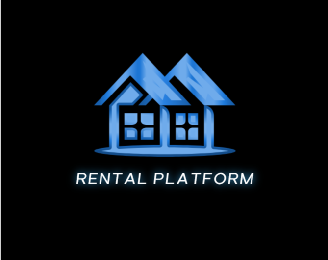
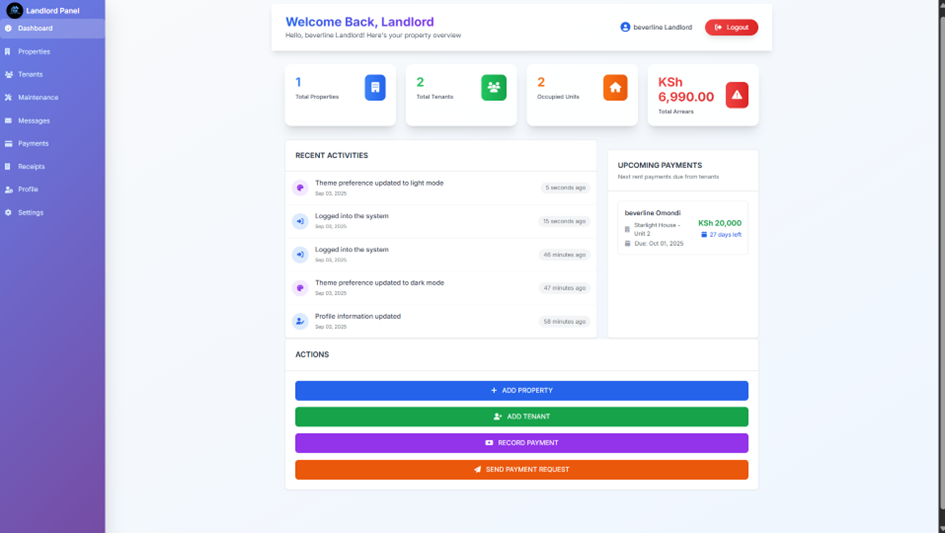
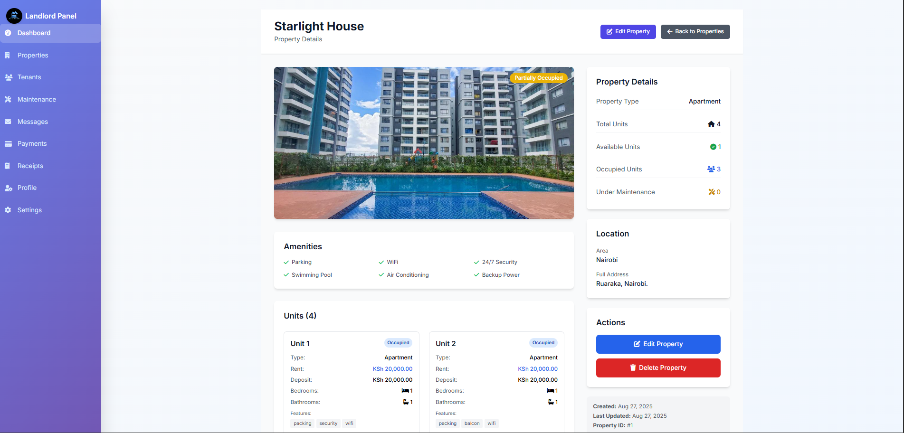
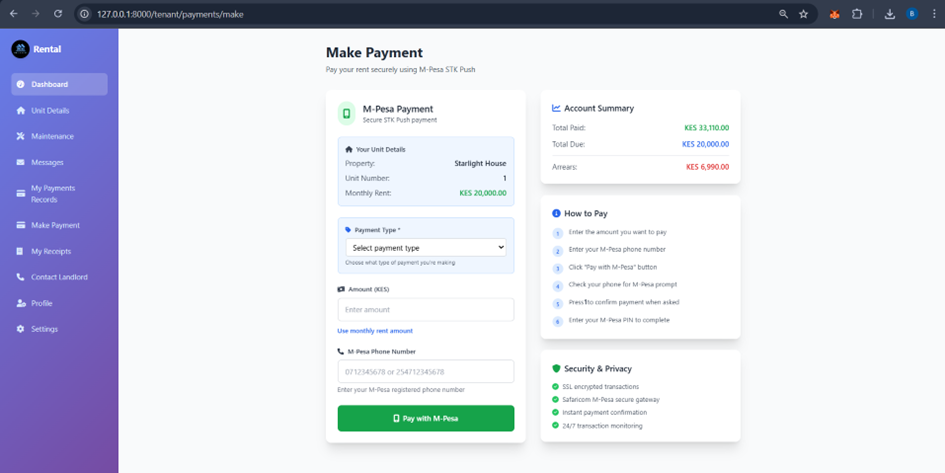
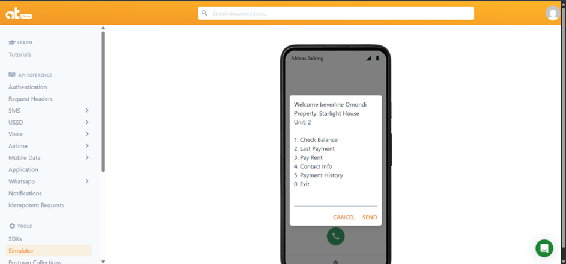

 # 🏠 Rental Management System

<div align="center">
  
</div>

<p align="center">
  <strong>Astra Spaces</strong> is a comprehensive rental management platform that enables landlords to manage properties, assign tenants, track rent payments, and allow tenants to interact via <em>USSD</em> and <em>M-Pesa STK Push</em>.
</p>

<div align="center">
  
  
  
  
  
  
</div>

---

## 🚀 📱 Key Features Screenshots

### 🏢 Landlord Dashboard
<div align="center">
  
  <p><em>Complete landlord management interface with property overview, tenant management, and financial tracking</em></p>
</div>

### 👤 Tenant Dashboard  
<div align="center">
  
  <p><em>User-friendly tenant portal for rent payments, maintenance requests, and communication</em></p>
</div>

### 🏠 Property & Unit Assignment
<div align="center">
  
  <p><em>Efficient property management with unit allocation and tenant assignment system</em></p>
</div>

### 💳 M-Pesa STK Push Integration
<div align="center">
  
  <p><em>Seamless rent collection through Safaricom's M-Pesa STK Push API</em></p>
</div>

### 📱 Africa's Talking USSD
<div align="center">
  
  <p><em>USSD-based tenant interaction for rent payments and account management</em></p>
</div>
---

## 🛠 Tech Stack
- *Backend*: Laravel-PHP 
- *Database*: MySQL (v5.7+) 
- *Payment API*: Safaricom Daraja API 
- *USSD API*: Africa's Talking 

---

## 📦 Installation & Setup

{{ ... }}
-composer
-laravel framework
- PHP 
- MySQL 5.7+
- Git
- Hosting account or XAMPP/Laragon

### Steps
1. Clone the repository:
   ```bash
   git clone https://github.com/ASTRA-INDUSTRIAL-ATTACHMENT/Astra-Spaces-PR-01-0001-2025.git
   cd Astra-Spaces-PR-01-0001-2025
2. **Install PHP dependencies**
   ```bash
   composer install
   ```
3. **Install Node.js dependencies**
   ```bash
   npm install
   ```
4. **Environment setup**
   ```bash
   cp .env.example .env
   php artisan key:generate
   ```    
5. Configure database in .env
   ```bash
   '.env'
   ```
6.  **Run migrations and seeders**
   ```bash
   php artisan migrate --seed
   ```
7. **Compile assets**
   ```bash
   npm run dev
   ```
8. **Start the development server**
   ```bash
   php artisan serve
   ```


